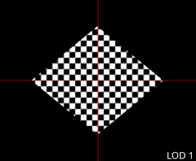
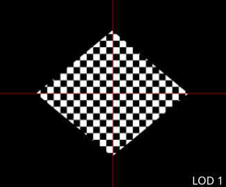

# generateMipmap phase shift test

This tool demonstrates whether the used `generateMipmap` implementation produces a correctly aligned scaled-down image across all mip levels. 

In some environments, certain texture dimensions cause the image to spatially shift at specific LOD levels.

|  |  |
| :---: | :---: |
| shifting implementation | stable implementation |

## When does the shift happen?

The WebGL/OpenGL specification for `generateMipmaps` provides significant flexibility for implementations. Many drivers utilize a "fast" downsampling filter that lacks proper **centroid compensation**. 

This results in a phase shift **if the aspect ratio changes** between levels. This occurs whenever one dimension is truncated (rounded down) while the other is not.

### Examples:
- **317x317**: Stays stable. Both axes hit the "odd-number wall" simultaneously, maintaining a consistent 1:1 ratio.
- **2048x910**: Triggers a phase shift. The height becomes fractional ($910 \to 455 \to \lfloor 227.5 \rfloor$) while the width remains a clean power of two and never requires rounding.

## Calculating texture sizes that cause this

Mip sizes are calculated as: `floor(originalSize / 2^mipLevel)`.

It is possible to find problematic sizes that cause a truncation at a specific LOD, by multiplying a fractional size (ending in `.5`, `.25`...) by a power of two.

**Formula**: $F \times 2^n$ (where $F$ is a value like $16.5$)

**Example**: $16.5 \times 32 = 528$
- A texture with a dimension of **528** is guaranteed to exhibit a round-down error at the **5th mip level**.

Note that shifts occurring at later (smaller) mip levels result in a larger visible drift relative to the total canvas size.

## Platform Observations

Based on initial testing:
- **Linux**: Frequently demonstrates the phase shift problem across various GPU brands.
- **Windows**: Implementations appear stable regardless of GPU type. This is likely due to the strict coordinate mapping requirements of the **D3D/ANGLE** translation layer.
